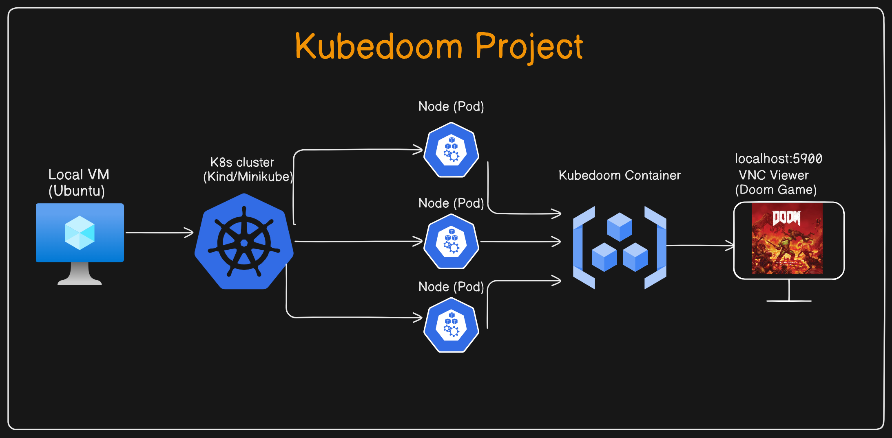

# Kube DOOM Project for Kubernetes learning purposes

## Kill Kubernetes pods using Id's Doom!

The next level of chaos engineering is here! Kill pods inside your Kubernetes
cluster by shooting them in Doom!

This repo is contain about the Kube Doom project for learning and implementing the Kubernetes and killing the pods inside your kubernetes cluster.

The credit goes to [iiDKx](https://github.com/iiDKx/kubedoom-prometheus) & [storax/kubedoom](https://github.com/storax/kubedoom).

 I've updated the Ubuntu and Kubernetes versions and included a metrics+monitoring k8s stack with Prometheus and Grafana. This is to help better visualize this demo.

 The following steps by step guide is to implement the KubeDoom Project

 <b>Prerequisites Requirements</b> 

This is project can be implemented on your local machine (VM), AWS Cloud or any other cloud provider which suites you.

1.Local Machine(VM) <a href = "https://releases.ubuntu.com/22.04/">(Ubuntu 22.04)</a>

2.Docker Installed [link](https://docs.docker.com/engine/install/ubuntu/)

3.[Kind](https://kind.sigs.k8s.io/docs/user/quick-start/) or [Minikube](https://minikube.sigs.k8s.io/docs/start/) or [kubeadm](https://kubernetes.io/docs/setup/production-environment/tools/kubeadm/install-kubeadm/) Installation. (Install Kind quickly with:
`./install-prereqs.sh`)

4. [TigerVNC Viewer](https://installati.one/install-tigervnc-viewer-ubuntu-22-04/)

# 

# 


Step ----- 01  

After installation of VM (ubuntu), please make sure your sytstem is updated

# Basic command to make sure all are update

sudo apt update
sudo apt-get update

# Check IP 

ifconfig 
ip --brief addr show

# Check firewall 

sudo ufw status
sudo ufw allow 22/tcp

# swapoff
sudo -i
swapoff - a

Running Kubedoom inside Kubernetes

Install kind master and worker node

See the example in the `/manifest` directory. You can quickly test it using
[kind](https://github.com/kubernetes-sigs/kind). Create a cluster with the
example config from this repository:

```console
$ kind create cluster --config kind-config.yaml
Creating cluster "kind" ...
 ✓ Ensuring node image (kindest/node:v1.25.3) 🖼
 ✓ Preparing nodes 📦 📦
 ✓ Writing configuration 📜
 ✓ Starting control-plane 🕹️
 ✓ Installing CNI 🔌
 ✓ Installing StorageClass 💾
 ✓ Joining worker nodes 🚜
Set kubectl context to "kind-kind"
You can now use your cluster with:


kubectl cluster-info --context kind-kind

Not sure what to do next? 😅  Check out https://kind.sigs.k8s.io/docs/user/quick-start/
```

Set your Kube context with: `kubectl cluster-info --context kind-kind`

This will spin up a 2 node cluster inside docker, with port 5900 exposed from
the worker node. Then run kubedoom inside the cluster by applying the manifest
provided in this repository:

# goto manifest and apply 

$ kubectl apply -k manifest/ 

namespace/kubedoom created
deployment.apps/kubedoom created
serviceaccount/kubedoom created
clusterrolebinding.rbac.authorization.k8s.io/kubedoom created
```


To connect run:  (Step -- 06)
```console
$ vncviewer viewer localhost:5900
```

Kubedoom requires a service account with permissions to list all pods and delete
them and uses kubectl 1.25.3.


## Running Locally

In order to run locally you will need to

1. Run the kubedoom container
2. Attach a VNC client to the appropriate port (5901)

### With Docker (Step -- 03)

Build the image with `docker build --build-arg=TARGETARCH=amd64 . -t kubedoom` while in this directory. Then run:

```console  (step 04)
$ docker run -p5801:5800 \
  -e NAMESPACE=default \
  --net=host \
  -v ~/.kube:/root/.kube \
  --rm -it --name kubedoom \
  kubedoom:latest
```

Optionally, if you set `-e NAMESPACE={your namespace}` you can limit Kubedoom to deleting pods in a single namespace

### With Podman

Run `kubedoom:latest` with podman locally:

```console
$ podman run -it -p5901:5900/tcp \
  -v ~/.kube:/tmp/.kube --security-opt label=disable \
  --env "KUBECONFIG=/tmp/.kube/config" --name kubedoom
  kubedoom:latest
```

### Attaching a VNC Client  (Step -- 07)

Now start a VNC viewer and connect to `localhost:5900`. The password is `idbehold`:
```console
$ vncviewer viewer localhost:5901
```
You should now see DOOM! Now if you want to get the job done quickly enter the
cheat `idspispopd` and walk through the wall on your right. You should be
greeted by your pods as little pink monsters. Press `CTRL` to fire. If the
pistol is not your thing, cheat with `idkfa` and press `5` for a nice surprise.
Pause the game with `ESC`. `iddqd` for god mode.

Cheat codes found here: https://doom.fandom.com/wiki/Doom_Cheat_Codes

### Killing namespaces

Kubedoom now also supports killing namespaces [in case you have too many of
them](https://github.com/storax/kubedoom/issues/5). Simply set the `-mode` flag
to `namespaces`:

```console
$ docker run -p5901:5900 \
  --net=host \
  -v ~/.kube:/root/.kube \
  --rm -it --name kubedoom \
  kubedoom:latest \
  -mode namespaces
```

## Building Kubedoom

The repository contains a Dockerfile to build the kubedoom image. You have to
specify your systems architecture as the `TARGETARCH` build argument. For
example `amd64` or `arm64`.

```console
$ docker build --build-arg=TARGETARCH=amd64 -t kubedoom .
```

To change the default VNC password, use `--build-arg=VNCPASSWORD=differentpw`.

## Deploying Prometheus  (Step -- 08)

Create a `monitoring` namespace to keep things tidy.

`kubectl create namespace monitoring`

Deploy Prometheus to scrape and store metrics for your cluster with:

`kubectl apply -f k8s/prometheus.yaml -n monitoring`

List the Prometheus pod name and IP address.

```
$ kubectl get pods -o wide -n monitoring
NAME                                     READY   STATUS    RESTARTS      AGE   IP           NODE          NOMINATED NODE   READINESS GATES
prometheus-deployment-75cff7d89f-w422q   1/1     Running   1 (15m ago)   25m   10.244.1.3   kind-worker   <none>           <none>
```

In a separate terminal run the below command to port-forward and you'll be able to access Prometheus on `http://localhost:8080`:

`kubectl port-forward -n monitoring prometheus-deployment-75cff7d89f-w422q 8080:9090`

To run in background:

`kubectl port-forward -n monitoring prometheus-deployment-75cff7d89f-w422q 8080:9090 &`

Prometheus graph display command.

`rate(container_cpu_usage_seconds_total{namespace="default", container="nginx"}[30s]) * 100`


## Deploying Grafana  (Step -- 09)
  
Deploy Grafana to graph our metrics from Prometheus with:

`kubectl apply -f k8s/grafana.yaml -n monitoring`

In another terminal, list the pod names and port-forward from one of the pods:

```
$ kubectl get pods -n monitoring
NAME                                     READY   STATUS    RESTARTS      AGE
grafana-5469c64c7d-ddz4r                 1/1     Running   1 (20m ago)   30m
grafana-5469c64c7d-xdlmw                 1/1     Running   1 (20m ago)   30m
prometheus-deployment-75cff7d89f-w422q   1/1     Running   1 (20m ago)   30m

$ kubectl port-forward -n monitoring grafana-5469c64c7d-ddz4r 3000
Forwarding from 127.0.0.1:3000 -> 3000
Forwarding from [::1]:3000 -> 3000
```

Grafana should now be reachable at `http://localhost:3000`.

Log in with username `admin` and password `admin`.

Once you are logged in, you will need to go to the Settings (gear icon bottom left) and edit the `Data sources`.

Change the URL in the settings from `http://prometheus-service.monitoring.svc:8080` to `http://<Prometheus Pod IP>:9090`. Use the below command to get the Prometheus pod IP.

```
$ kubectl get pods -o wide -n monitoring
NAME                                     READY   STATUS    RESTARTS      AGE   IP           NODE          NOMINATED NODE   READINESS GATES
prometheus-deployment-75cff7d89f-w422q   1/1     Running   1 (15m ago)   25m   10.244.1.3   kind-worker   <none>           <none>
```

So I would enter `http://10.244.1.3:9090` as my data source. Save and test this.

### Nginx Dashoard Example (Step --- 05)

Deploy some Nginx pods to your cluster:

`kubectl apply -f k8s/nginx-deployment.yaml`

Create a dashboard in Grafana to monitor the Nginx containers. To do this open Grafana at `http://localhost:3000` and login. Make sure you have your data source set to your Prometheus pod from the previous step. From the left hand menu, create a new dashboard and add a panel. Select the panels dropdown menu, select `Inspect` and then select `Panel JSON`. Here you will be able to delete the current JSON and replace it with JSON from the grafana folder `./grafana/nginx-panel.json`. Save and apply this and you should be able to see the CPU usage of the current deployed pods.

You can refresh the dashboard as you kill the pods from Kubedoom and expand upon this to track other metrics and applications in your cluster.
