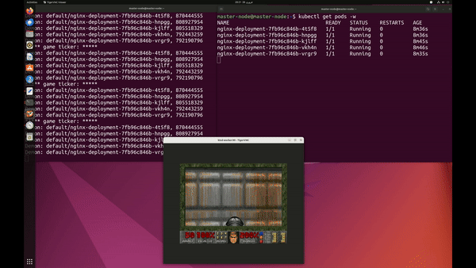
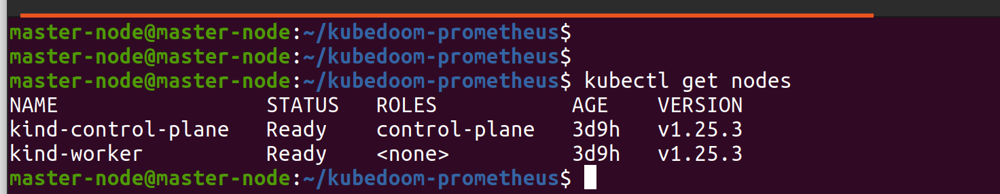
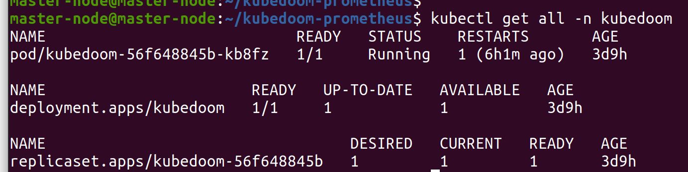
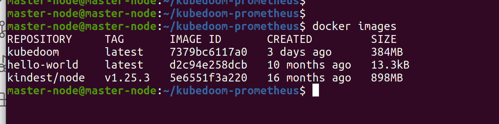
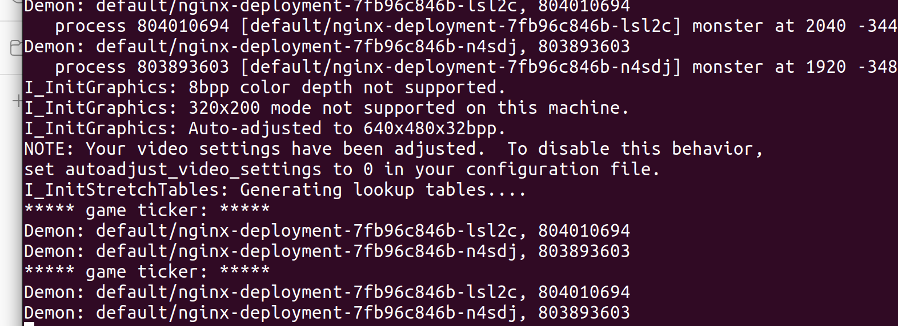
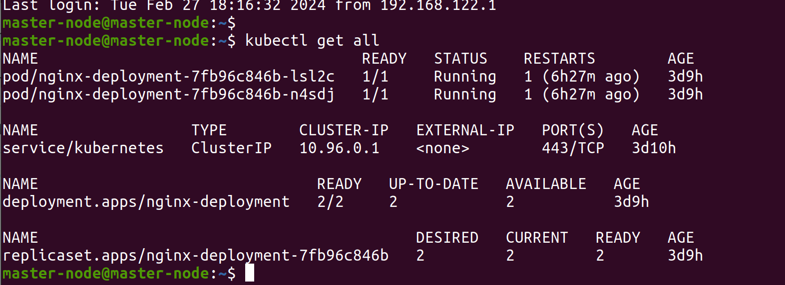
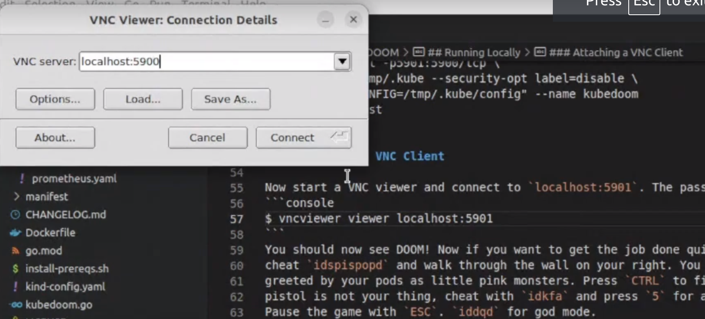
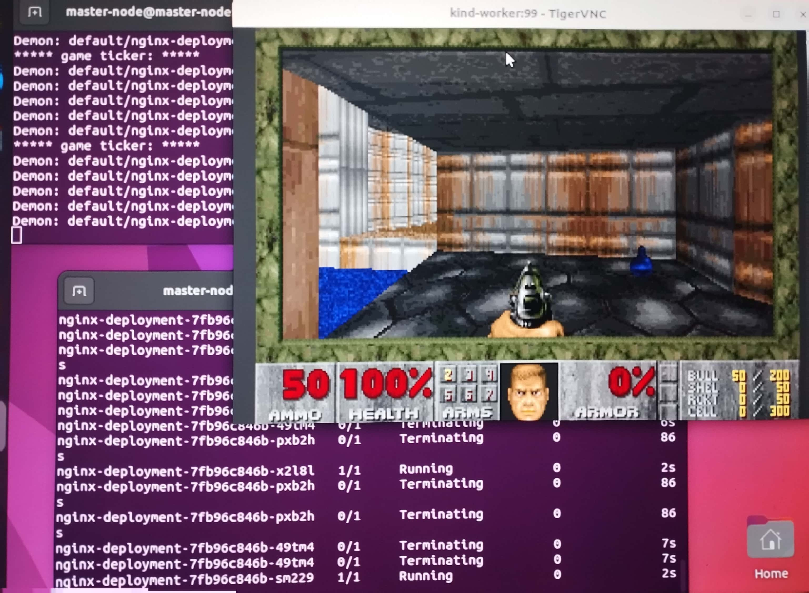

# Kube DOOM Project for Kubernetes learning purposes

## Kill Kubernetes pods using Id's Doom!

The next level of chaos engineering is here! Kill pods inside your Kubernetes
cluster by shooting them in Doom!

This repo is contain about the Kube Doom project for learning and implementing the Kubernetes and killing the pods inside your Kubernetes cluster.

The credit goes to [iiDKx](https://github.com/iiDKx/kubedoom-prometheus) & [storax/kubedoom](https://github.com/storax/kubedoom).

 <!--I've updated the Ubuntu and Kubernetes versions and included a metrics+monitoring k8s stack with Prometheus and Grafana. This is to help better visualize this demo.** -->


 The following steps are involved  in implementing the KubeDoom Project

 ## Prerequisites

This is project can be implemented on your local machine (VM), AWS Cloud or any other cloud provider which suites you.

- Local Machine(VM) <a href = "https://releases.ubuntu.com/22.04/">(Ubuntu 22.04)</a>
- Docker Installation [link](https://docs.docker.com/engine/install/ubuntu/)
- [Kind](https://kind.sigs.k8s.io/docs/user/quick-start/) or [Minikube](https://minikube.sigs.k8s.io/docs/start/) or [kubeadm](https://kubernetes.io/docs/setup/production-environment/tools/kubeadm/install-kubeadm/) Installation. (Install Kind quickly with:
`./install-prereqs.sh`)
- [TigerVNC Viewer](https://installati.one/install-tigervnc-viewer-ubuntu-22-04/)

# 
# 


### Step 1: Update VM/Ubuntu

After installation of VM (ubuntu), please make sure your system is updated
``` shell
#Basic command to make sure all are updated
sudo apt update
sudo apt-get update
#Check IP 
ifconfig 
ip --brief addr show
#Check firewall 
sudo ufw status
sudo ufw allow 22/tcp
#swapoff
sudo -i
swapoff - a
```

### Step 2: Steup Kubernetes Cluster (Kind)

Running Kubedoom inside Kubernetes

Install kind master and worker node

See the example in the `/manifest` directory. You can quickly test it using [kind](https://github.com/kubernetes-sigs/kind). Create a cluster with the
example config from this repository:

``` shell
$ kind create cluster --config kind-config.yaml
Creating cluster "kind" ...
 ✓ Ensuring node image (kindest/node:v1.25.3) 🖼
 ✓ Preparing nodes 📦 📦
 ✓ Writing configuration 📜
 ✓ Starting control-plane 🕹️
 ✓ Installing CNI 🔌
 ✓ Installing StorageClass 💾
 ✓ Joining worker nodes 🚜
Set kubectl context to "kind-kind"
You can now use your cluster with:

kubectl cluster-info --context kind-kind
Not sure what to do next? 😅  Check out https://kind.sigs.k8s.io/docs/user/quick-start/
```

# 

Set your Kube context with: `kubectl cluster-info --context kind-kind`

This will spin up a 2 node cluster inside docker, with port 5900 exposed from the worker node. Then run kubedoom inside the cluster by applying the manifest
provided in this repository.
The Kubernetes-Manifests-Files directory holds Kubernetes manifests for deploying your application on cluster.

``` shell
$ kubectl apply -k manifest/ 
namespace/kubedoom created
deployment.apps/kubedoom created
serviceaccount/kubedoom created
clusterrolebinding.rbac.authorization.k8s.io/kubedoom created
```

# 


### Step 3: Docker Build

Build the image with `docker build --build-arg=TARGETARCH=amd64 . -t kubedoom` while in this directory. Then run:

# 


``` shell 
#docker run command and and attached pods
$ docker run -p5801:5800 \
  -e NAMESPACE=default \
  --net=host \
  -v ~/.kube:/root/.kube \
  --rm -it --name kubedoom \
  kubedoom:latest
```
Optionally, if you set `-e NAMESPACE={your namespace}` you can limit Kubedoom to deleting pods in a single namespace

# 


### Step 4: Docker Build

Deploy some Nginx pods to your cluster:

`kubectl apply -f k8s/nginx-deployment.yaml`

You can refresh the dashboard as you kill the pods from Kubedoom and expand upon this to track other metrics and applications in your cluster.

# 


### Step 5: Attaching a VNC Client

Now start a VNC viewer and connect to `localhost:5900`. The password is `idbehold`:

``` shell 
$ vncviewer viewer localhost:5901
```

You should now see DOOM! Now if you want to get the job done quickly enter the
cheat `idspispopd` and walk through the wall on your right. You should be
greeted by your pods as little pink monsters. Press `CTRL` to fire. If the
pistol is not your thing, cheat with `idkfa` and press `5` for a nice surprise.
Pause the game with `ESC`. `iddqd` for god mode.

Cheat codes found here: https://doom.fandom.com/wiki/Doom_Cheat_Codes

# 

# 

```
To connect run:  
```
``` shell 
$ vncviewer viewer localhost:5900

```

### Step 6: Kubedoom demo

# 

# 


